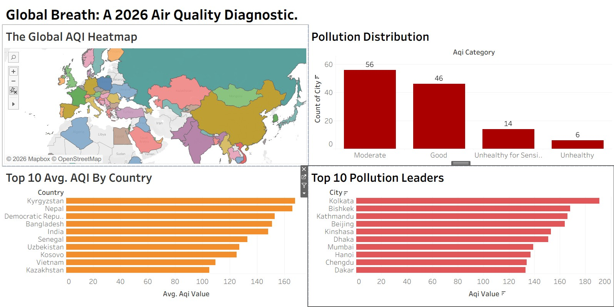

# Global Air Quality Index (AQI) Trend Mapping & Analysis

## 🌐 Project Overview
This project is a comprehensive Data Science pipeline designed to monitor, analyze, and visualize real-time global air quality levels. Using data from **IQAir**, the system scrapes live pollution rankings, processes the data through a rigorous cleaning pipeline, and presents actionable insights via an interactive Tableau dashboard.

**🚀 Live Dashboard:** [View Interactive Tableau Dashboard](https://public.tableau.com/app/profile/manjur.e.elahi.shimul/viz/GlobalAQIMapping/Dashboard1)

---

## 📊 Key Insights & Analysis
* **Global Inequality:** There is a stark contrast between coastal cities (which benefit from natural dispersion) and inland basin cities (which trap pollutants).
* **Systemic Averages:** While individual cities spike due to local events, countries like India, Pakistan, and Kyrgyzstan show high systemic averages, indicating long-term industrial and seasonal challenges.

---

## 🛠️ Technical Stack
* **Scraping & Engineering:** Python, Selenium (for JS-rendered dynamic content), BeautifulSoup4.
* **Data Manipulation:** Pandas (Cleaning, Feature Engineering, Categorization).
* **Exploratory Data Analysis (EDA):** Jupyter Notebooks, Matplotlib, Seaborn.
* **Visualization:** Tableau Public.
* **Version Control:** Git & GitHub.

---

## 🧬 Data Pipeline
1. **Web Scraping:** Utilized Selenium to navigate IQAir’s dynamic ranking table, overcoming JavaScript rendering hurdles to extract city-specific AQI data.
2. **Data Cleaning:** Used Pandas to handle nested HTML strings, separating City and Country names, and converting raw values into US-EPA AQI Categories.
3. **Exploratory Analysis:** Conducted statistical analysis in a Jupyter Notebook to identify outliers, calculate country-wide averages, and determine category distributions.
4. **Visualization:** Exported cleaned datasets to Tableau to build a multi-view dashboard featuring KPI tiles, global heatmaps, and ranking bars.

---

## 📁 Repository Structure
* `/scripts`: Selenium scraping pipeline.
* `/notebooks`: Pandas EDA and statistical analysis.
* `/data`: Raw and processed datasets (CSV).
* `Dashboard.jpg`: High-resolution preview of the final analysis.
* `requirements.txt`: Reproducible environment setup.

---

**Author:** Manjur-E-Elahi Shimul  
**Connect with me:** [Linkedin](https://www.linkedin.com/in/manjur-e-elahi-shimul-650a8381/)
